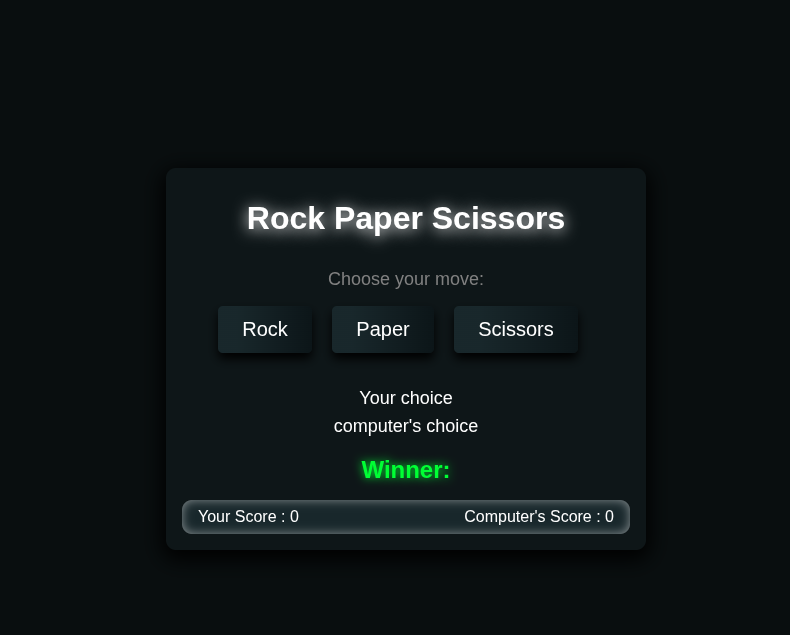
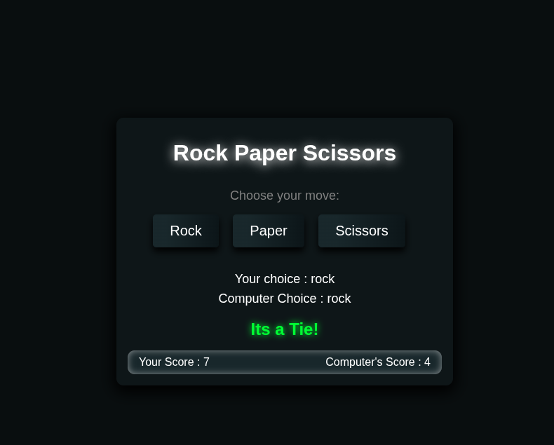

# Rock Paper Scissors

A simple Rock Paper Scissors game built using HTML, CSS, and JavaScript.

## Features

* Play Rock, Paper, Scissors against the computer
* Random computer move generation
* Automatic winner detection
* Live score tracking
* Clean dark-themed user interface
* Hover and click animations

## Technologies Used

* HTML
* CSS
* JavaScript

## Project Structure

Rock-Paper-Scissors
│
├── index.html
├── style.css
├── script.js
└── README.md

## How to Run

1. Download or clone the repository.
2. Open the project folder.
3. Open `index.html` in your browser. 
   or
4. Use the demo link

## What I Learned

* DOM Manipulation
* Event Listeners
* Functions
* Conditional Statements
* Random Number Generation
* Basic Game Logic

## Game Screenshots

Here is the rock selection screen:

And the game in action:

   